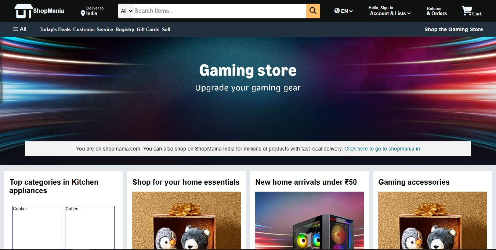

# 🛍️ ShopMania

Welcome to **ShopMania**, a fully responsive and modern e-commerce homepage layout built using pure **HTML5** and **CSS3**. It features a clean UI inspired by real-world shopping platforms, making it ideal for learning and showcasing front-end development skills.

---

## 📸 Demo

  
> _(Optional: Replace with your own screenshot or demo GIF of the project in action)_

---

## 🚀 Features

- ✅ Responsive Header with:
  - Logo and Brand Name
  - Delivery Location
  - Search Bar with Category Select
  - Language Selector
  - Sign-In / Account Links
  - Cart Icon

- ✅ Navigation Panel:
  - Hamburger Menu
  - Quick Links (Deals, Registry, Customer Service, etc.)
  - Highlighted Shop Section

- ✅ Hero Section:
  - Location-based message with redirect link

- ✅ Shopping Section:
  - 8 Product Boxes with Categories
  - Titles, Images, and "See more..." call-to-actions

- ✅ Footer:
  - Back to Top link
  - Informational Columns (Get to Know Us, Make Money with Us, etc.)
  - Language / Currency Selector
  - Legal Information & Copyright

---

## 🧱 Tech Stack

| Tech        | Description              |
|-------------|--------------------------|
| HTML5       | Structure of the website |
| CSS3        | Styling and layout       |
| Font Awesome | Icons and visuals       |

---

## 📁 Folder Structure

ShopMania/
├── index.html
├── styles.css
├── assets/
│ ├── box7_img.jpg
│ ├── box8_img.jpg
│ ├── hero_image.jpg
│ ├── demo-banner.jpg
│ └── Shopping_ori.jpg
